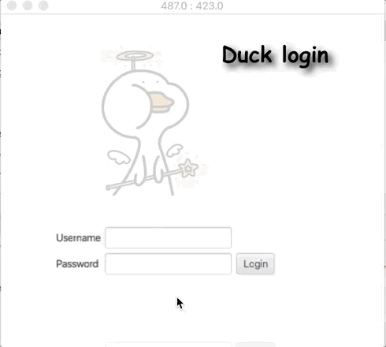

# Duck - User Guide
By: `Wang Qin` Since: `Sep 2020`


* [1. Introduction](#introduction)
* [2. Quick Start](#quick-start)
* [3. Features](#features)
    + [3.1. Add a task:](#addtask) `add`
    + [3.2. List all tasks:](#list) `list`
    + [3.3. Find a task by keywords:](#find) `find`
    + [3.4. Delete a task:](#delete) `delete`
    + [3.5. Delete all tasks in the task list](#clear) `clear`
    + [3.6. Complete a task:](#complete) `done`
    + [3.7. Show all possible functions:](#help) `help`
    + [3.8. Undo:](#undo) `undo`
    + [3.9. Navigate through command history:](#Navi) `Up` `Down` 
    + [3.10. Change the system language:](#Change) `change`
    + [3.11. Check all task due/happene on a certain date:](#due) `due`
    + [3.12. Exiting the program:](#exit) `bye`
* [4. FAQ](#faq)
* [5. Command Summary](#command-summary)


<a name="introduction"></a>


##  1. Introduction
Duck is a task manage system

<a name="quick-start"></a>

## 2. Quick Start

*    Ensure that `Java 11` or above is installed in your Computer.
*    Download the latest `Duck.jar` [_here_](https://github.com/JosephLimWeiJie/duke/releases/download/v0.2.0/duke.jar).
*    Double click the jar file
*    Enter the correct `username` and `password` (default username is `duck` default password is `123`) ,then press `ENTER` key

  


<a name="features"></a>
## 3. Features


<a name="addtask"></a>

### 3.1 Add a task: `add`

Adds a task into Duck

* **Format**: 
    * `todo TASK_DESCRIPTION`
    * `deadline TASK_DESCRIPTION /by DATE_TIME`
    * `event TASK_DESCRIPTION /at START_DATE_TIME`

* **Examples**:
    * `todo return book`
    * `deadline Thesis submission /by 12-12-2019`
    * `event Wedding Ceremony /at 12-12-2019`
    
    
    
    

<a name="list"></a>

### 3.2. List all tasks: `list`

Shows a list of all the tasks in Duke.

**Format**: `list`


<a name="find"></a>

### 3.3 Find a task: `find`

Finds tasks that contain a given keyword.

**Format** : `find KEYWORD`

**Example**: `find book`


<a name="delete"></a>

### 3.4 Delete a task: `delete`
Deletes a specified task from Duke.

**Format**: `delete INDEX`

* **Examples**:
    * delete 1
    * delete 2

```javascript
    * Deletes the task at the specified INDEX.
    * The index refers to the index number shown on the displayed task list.
    * The index must be a positive number 1,2,3,...
```
   

<a name="clear"></a>

### 3.5 Delete all tasks in the task list: `clear`
Filters tasks based on a given DATE.

**Format**: `clear`

**Example**: `clear`

<a name="complete"></a>

### 3.6 Complete a task: `done`

Marks a task as completed at the specified INDEX.

**Format**: `done INDEX`

* **Examples**:
    * done 1
    * done 2

```javascript
    * The index refers to the index number shown on the displayed task list.
    * The index must be a positive number 1,2,3,..
```
    
   

<a name="help"></a>

### 3.7. Show all possible functions: `help`

List all help functions, their usages and their examples.
An interesting fact is not only `help` can make `Kuri` list all possible functions, but also all unrecognized commands. 

**Format**: `help`

<a name="undo"></a>

### 3.8. Undo a command: `undo`

The undo command is only for those "data-changing" operations. For example, adding a task, deleting a task, or marking a task as done.

**Format**: `undo`

* **Example**:
    * undo

    


<a name="Navi"></a>

### 3.9 Navigate through command history: `Up` `Down` 

Navigate through the command history by `Up` and `Down` arrow on the keyboard

**Format**: `Up` `Down`


   


<a name="Change"></a>

### 3.10 Change the system language: `change`

Changes the system display language 
(The duck system supports English and Chinese)

**Format**: `change Language`
* **Example**:
    * change Chinese
    
    


<a name="due"></a>

### 3.11 Check all tasks due/happene on a certain date: `due`

List all tasks happens/ due on a certain date

**Format**: `due DATE`
* **Example**:
    * due 12-12-2019
    
    
    
    
<a name="exit"></a>

### 3.12 Exiting the program: `bye`

Exits the program.

**Format**: `bye`


<a name="faq"></a>

## 4. FAQ

*Q1:* Why the jar file is much larger (about 100 mb) compared to others?

*A:* Due to the mass use of external libraries, the `Duck.jar` contains not only the executable program, but also all of the 
    libraries as well as output file (.json). So that, users do not need to copy the data file (.json) when he wants to use Kuri on another
    computer. Only one `Duck.jar` is needed. 


<a name="command-summary"></a>

## 5. Command Summary
* Add 
    * Format: 
        * `todo TASK_DESCRIPTION`
        * `deadline TASK_DESCRIPTION /by DATE_TIME`
        * `event TASK_DESCRIPTION /on START_DATE_TIME to END_DATE_TIME`
    * Examples:
        * `todo return book`
        * `deadline Thesis submission /by 12-12-2019`
        * `event Wedding Ceremony /at 12-12-2019`
* List: `list`
* Find: `find KEYWORD`
    * Examples:
        * `find book`
* Delete: `delete INDEX`
   * Examples:
        * `delete 2`
* Complete: `done INDEX`
    * Examples:
        * `done 1`
* Clear/Delete all tasks: `clear`
* Help: `help`
* Undo: `undo`
* Check all tasks due/happens on a given date: `due` 
* Navigate through the history command: `Up` `Down'
* Change the system language: `change` 
* Exit: `bye`


